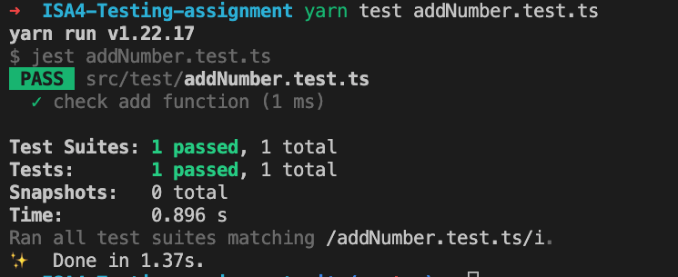

# Basic testing assignment

This assignment to practice unit test and integration test using Jest
 

# How to run the project:

1. Fork project and
2. run yarn or npm (depending on which package manager you are using)
3. yarn test addNumber.test.ts or npm run test addNumber.test.ts

 

## TODOs:

1. create a new functions to uppercase a string in the function folder
2. write test for the function above

 

### Here are couple of screenshots for a successful request:

`when the test passes it should show as below`

